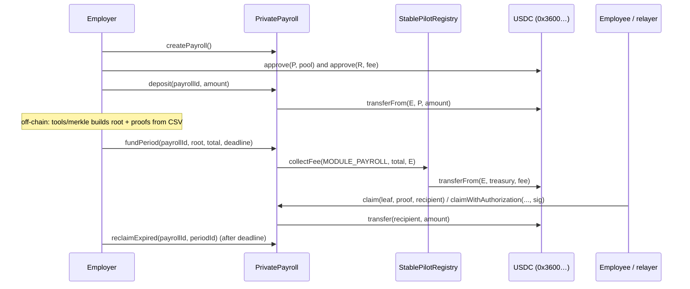

# PrivatePayroll — Design Document (v1)

| Field | Value |
|---|---|
| Status | Draft — v1 (commitment-based, no ZK) |
| Contract | `contracts/PrivatePayroll.sol` |
| Toolchain | Solidity 0.8.28, OpenZeppelin 5.1.0, Foundry 1.7.1, `evm_version = paris` |
| Target chain | Arc Testnet (chain ID 5042002) |
| Settlement token | USDC ERC-20 interface `0x3600000000000000000000000000000000000000` (6 decimals) |
| Fee registry | `StablePilotRegistry` `0x1070dc6494402aacaa5e701139d27f20de6527ff` (module id `MODULE_PAYROLL = 0`) |

## 1. Purpose

First StablePilot module. It exists to prove (a) the payroll business logic and (b) the protocol-fee
pattern through `StablePilotRegistry`, end to end, before the ZK version. Privacy in v1 is honest but
limited; see §6.

## 2. Flow



1. `createPayroll()` — caller becomes the payroll's employer.
2. `deposit()` — single pooled USDC balance per payroll (unallocated). `withdrawUnallocated()` any time.
3. `fundPeriod(root, total, deadline)` — moves `total` from the pool to a new period, stores only the
   Merkle root and total, charges the protocol fee. Deadline ∈ [now + 7 days, now + 730 days].
4. `claim()` — the employee named in the leaf reveals `(index, employee, amount, salt)` + proof and chooses
   any `recipient`. `claimWithAuthorization()` — anyone submits with an EIP-712 `ClaimAuthorization`
   signature from the employee (EOA, EIP-7702-delegated EOA, or ERC-1271 wallet); gasless for the employee.
5. `reclaimExpired()` — after the (pause-adjusted) deadline the employer takes back `total - claimed`.

### Leaf encoding (must match `tools/merkle`)

```
leaf = keccak256(bytes.concat(keccak256(abi.encode(payrollId, periodId, index, employee, amount, salt))))
types: (uint256, uint256, uint256, address, uint256, bytes32); nodes: sorted-pair keccak256
```

Differences from the brief's `keccak256(abi.encode(employee, amount, periodId, salt))`, on purpose:
- `index` is included so double-claim protection can be a **bitmap** and one leaf maps to exactly one slot
  (a proof cannot be replayed under another index).
- `payrollId` is included so a leaf is bound to one payroll, not just a period number.
- Double hashing = OpenZeppelin `StandardMerkleTree` format (audited JS library, second-preimage safe).
- `salt` (32 random bytes per entry) is essential: salaries live in a small search space, so without a
  salt anyone could brute-force the amounts behind a root.

A test vector (`tools/merkle/fixtures/example.csv` → `example.expected.json`) is checked by the TS tests
and replayed in `PrivatePayroll.t.sol` (`test_Fixture_*`), so the off-chain and on-chain encodings are
locked together.

## 3. Protocol fee integration (StablePilotRegistry)

**Choice: one fee per funded period**, inside `fundPeriod`:
`registry.collectFee(MODULE_PAYROLL, total, employer)`, i.e. `txAmount = period total`, `payer = employer`.

Why per period rather than per claim:

| Criterion | Per period (chosen) | Per claim |
|---|---|---|
| Privacy | `FeeCollected(moduleId, payer, fee, txAmount)` exposes only the period total, which is already public | Every claim would publish `payer` + that salary as `txAmount` in a second, easily indexed event |
| Who pays / discounts | Employer pays; registry partner discounts are keyed by `payer`, so employer discounts work | Employee would pay (needs an allowance to the registry, reduces net pay), or the payroll contract pays from the pool (discounts stop applying, pool accounting leaks) |
| Registry design fit | Matches the registry doc's sequence (`collectFee(MODULE_PAYROLL, batchTotal, User)`) and "atomic with the business transaction" (funding is the business transaction) | N collectFee calls per period |
| Gas | 1 call per period | 1 extra external call + transfer per employee |

Properties:
- The fee is pulled **by the registry directly from the employer** (`safeTransferFrom(employer, treasury, fee)`).
  PrivatePayroll never approves the registry and the pool is never touched by fees, so employees always
  receive exactly their committed amount. The employer must `approve(registry, quoteFee(payrollId, total))`.
- `quoteFee()` = `registry.computeFee(MODULE_PAYROLL, total, employer)`; the test suite asserts
  `fee == computeFee` and `treasury delta == fee` (unit, fuzz and invariant tests).
- `feesEnabled == false` or `feeRateBps[0] == 0` → fee 0, funding still works.
- Unclaimed funds reclaimed after expiry are **not** refunded their fee (fee is on funded volume).

### Registry changes required

No code change and **no redeploy** of the registry. After PrivatePayroll is deployed, the registry owner
(currently `0x5B12Ce46C7194aD57d143bC22847224047b1Ef42`, which is also the treasury) must call:

1. `addModule(<PrivatePayroll>, 0)` — required. Without it `fundPeriod` reverts with `NotModule()`
   (registering under another id reverts with `ModuleIdMismatch()`).
2. `setFeeRate(0, <bps>)` — 0…500. On-chain today: `feeRateBps(0) = 0`.
3. `setFeesEnabled(true)` — on-chain today: `feesEnabled = false` (so fees are currently 0).

(State read on 2026-09-28 via `eth_call` against `https://rpc.testnet.arc.io`; `registry.usdc()` returns
`0x3600000000000000000000000000000000000000`.) PrivatePayroll's owner can point the module at a new registry
with `setRegistry()` (must use the same USDC and `MODULE_PAYROLL == 0`), per the registry's migration story.

## 4. Roles & trust

| Role | Can | Cannot |
|---|---|---|
| Employer (per payroll) | deposit / withdraw unallocated, fund periods (posts root), pause/unpause own payroll, reclaim after expiry | touch other payrolls; reclaim before the pause-adjusted deadline; take funds of a funded period early |
| Employee (leaf `employee`) | claim once per leaf, to any recipient; authorize a relayer via EIP-712 | claim more than the leaf amount or more than the period's remaining total |
| Protocol owner (`Ownable2Step`) | global pause/unpause, `setRegistry` | move or withdraw anyone's funds; renounce (disabled) |
| Registry owner | fee rate, fee switch, discounts, module (de)registration | touch payroll funds (payroll never approves the registry) |

Trust assumptions (v1): the employer is trusted to build a correct tree (it can omit someone or post a
wrong amount; the solvency guard limits damage to that period). Deregistering the module in the registry
blocks new funding only; existing periods stay claimable and reclaimable.

## 5. Safety properties

- `ReentrancyGuard` on every state-changing entry point that moves tokens; CEI order; `SafeERC20`.
- **No double claims**: `BitMaps` per (payrollId, periodId), index bound in the leaf.
- **Solvency guard**: `claimed + amount <= total` per period, so a malformed root can never drain other
  periods or the pool. Reclaimed periods are closed forever.
- **Deposit check**: balance delta must equal `amount` (rejects fee-on-transfer tokens).
- **Expiry**: claims allowed while `now <= effectiveDeadline`; reclaim only when `now > effectiveDeadline`.
- **Pause semantics**: employer pause blocks claims + new periods of that payroll; global pause blocks
  everything except `withdrawUnallocated`. Every second spent paused (per payroll and globally) is added to
  the claim deadline of periods funded before the pause, so pausing can never run out an employee's window.
  Overlapping payroll + global pauses are counted twice (can re-open an expired, un-reclaimed period) —
  this only favours employees and was chosen over exact interval-union bookkeeping.
- Custom errors; amounts stored as `uint128` (checked with `SafeCast` on deposit).
- Events carry no amounts beyond what the USDC `Transfer` already shows: `Claimed(payrollId, periodId, index)`
  has no amount or recipient. `PeriodFunded` includes `total` and `fee` (public anyway via calldata / registry).
- Not payable; never handles native value (on Arc native USDC has 18 decimals — only the 6-decimal ERC-20
  interface is used).

Invariants tested (`PrivatePayroll.invariant.t.sol`, random employer/employee/owner/time actions):
1. `deposits + fees == claimed + reclaimed + withdrawn + treasury + contract balance`
2. `treasury balance == Σ registry.computeFee(total) at funding time`
3. `contract balance == Σ pools + Σ (total − claimed) of non-reclaimed periods`, and `claimed ≤ total`
4. no leaf paid twice, no claim after the window or after reclaim, no reclaim before expiry

The invariant campaign found a real bug during development (claim on a reclaimed period after overlapping
pauses re-opened its window); fixed by closing reclaimed periods, with a regression unit test.

## 6. What is private / what is NOT private in v1

| Data | v1 | Notes |
|---|---|---|
| Individual salary before it is claimed | **Private** | Only a salted commitment (Merkle root) is on-chain |
| Salary schedule / full employee list | **Private** | Never on-chain; only the root. Off-chain tree file is confidential (employer's responsibility) |
| Salary amount at claim time | **NOT private** | Revealed in calldata and in the USDC `Transfer` |
| Employee address | **NOT private** at claim | Leaf preimage (calldata) contains it |
| Link employee → recipient | **NOT private** | Both are in the claim calldata. A fresh recipient only keeps funds out of the employee's main wallet / enables gasless claims; it does **not** give on-chain unlinkability |
| Period total | **NOT private** | `fundPeriod` argument; registry `FeeCollected.txAmount` |
| Employer identity, pool balance, fee paid | **NOT private** | Employer address is the payer/sender |
| Headcount | Partially | Not stored, but proof length ≈ log2(N) and the number of `Claimed` events leak an estimate |
| Which slots were claimed | **NOT private** | `Claimed(index)`; identities behind unclaimed slots stay hidden |
| Timing, relayer used | **NOT private** | Transaction metadata |

Bottom line: v1 hides salaries **until payout** and keeps the schedule off-chain; each payout is public.

## 7. Arc specifics

- USDC ERC-20 interface at `0x3600000000000000000000000000000000000000`, 6 decimals — verified in Arc docs
  (docs.arc.io › Contract addresses / Stablecoin native model / Infrastructure) and on-chain
  (`decimals() = 6`, `symbol() = "USDC"`, and the deployed registry's `usdc()` returns this address).
  Native USDC (gas, `msg.value`) uses 18 decimals and shares the same balance; this contract never mixes them.
- The deploy script reads `USDC_ADDRESS` (default above) and requires `registry.usdc() == USDC_ADDRESS`
  and `block.chainid == EXPECTED_CHAIN_ID` (default 5042002).
- USDC blocklist is enforced at runtime on Arc: a claim to a blocklisted recipient reverts; the employee can
  claim to another recipient. A blocklisted **payroll contract** would freeze all funds (Circle-level risk).
- Arc supports EIP-7702: signature checks try ECDSA first, then ERC-1271, so delegated EOAs still work.
- Block timestamps are non-decreasing at 1 s granularity; windows are day-scale, so this is irrelevant.
- Local tests use a mock ERC-20 and standard EVM; Arc-specific behaviour (native/ERC-20 USDC duality,
  blocklist) is not simulated — use Arc Foundry's `arc-anvil --network arc` for that before mainnet.

## 8. v2: ZK plan (shielded pool, note-based claims)

Goal: hide amounts **and** the employee↔recipient link at payout, keep the registry fee pattern.

1. **Shielded pool.** Employer deposits USDC into a pool contract (fee still charged once via
   `collectFee(MODULE_PAYROLL, total, employer)`). For each employee the employer creates a note
   `C = Poseidon(amount, ownerPubKey, salt, periodId)` and appends commitments to an on-chain incremental
   Merkle tree (depth ~20–32). Encrypted note data (to the employee's viewing key) is emitted so the
   employee can discover their note.
2. **Private claim / withdraw.** The employee proves in zero knowledge (Noir/UltraHonk or Circom/Groth16):
   knowledge of a note in the tree, ownership of `ownerPubKey`, and a nullifier `N = Poseidon(noteSecret)`.
   Public inputs: root, nullifier, recipient, relayer fee, withdrawn amount (or a commitment to change).
   The contract stores nullifiers (replacing the bitmap) and pays the recipient; a relayer submits so the
   recipient needs no gas history.
3. **Amount privacy.** Either keep value inside the pool (private note-to-note transfers, withdraw later /
   in chunks) or use fixed denominations for withdrawals; otherwise the withdrawal amount still leaks.
4. **Compliance.** Viewing keys for employer/auditor, optional association-set proofs (privacy-pools style),
   Arc USDC blocklist still applies to recipients.
5. **Migration.** Same registry, new module id or `MODULE_PAYROLL` re-pointed; v1 contracts remain for
   existing periods. The off-chain tool evolves from Merkle proofs to note generation + proving.

## 9. Open questions

- Fee on reclaimed (unpaid) volume: keep (current) or refund pro-rata?
- Claim window bounds (7–730 days) and whether the global pause should auto-expire (owner can currently
  pause indefinitely; funds are then frozen except unallocated withdrawals). Recommend a multisig/timelock owner.
- Employer key rotation (two-step employer transfer) — not in v1.
- Should the contract itself pay a relayer fee from the claimed amount (fully gasless claims)?
- Headcount padding (dummy zero-amount leaves) to blur the proof-length leak.

## 10. Test & coverage

`contracts/test/PrivatePayroll.t.sol` (unit + fuzz + fixture), `PrivatePayroll.invariant.t.sol`,
`DeployPrivatePayroll.t.sol`, `tools/merkle` (`npm test`). `forge coverage` on `PrivatePayroll.sol`:
100% lines, statements, branches and functions.
