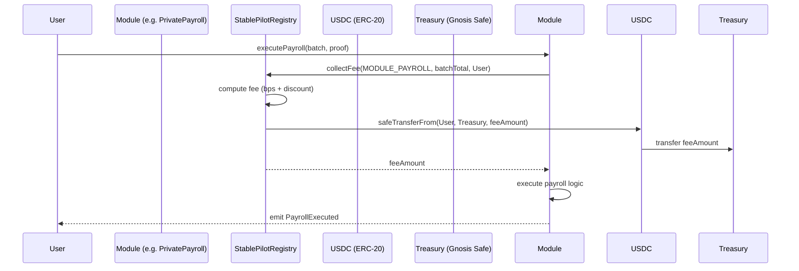

# StablePilotRegistry — Smart Contract Design Document

## 1. Metadata

| Field | Value |
|---|---|
| Status | Draft |
| Authors | StablePilot Protocol Team |
| Target Chain | Arc Testnet (chain ID 5042002) → Arc Mainnet (chain ID 5042) |
| Language / Toolchain | Solidity 0.8.24, Foundry (forge 0.2.0) |
| Milestone | Phase 1 — Testnet deployment |
| EVM Version | Paris (Arc constraint) |

> Note (2026-09-28): Arc Testnet chain ID corrected from 9870 to 5042002 (the network the registry is deployed on, at `0x1070dc6494402aacaa5e701139d27f20de6527ff`); other historical notes above are unchanged.

### Review tracker
- [ ] Design review
- [ ] Security review
- [ ] Ops review
- [ ] Compliance review

---

## 2. Action Items (living)

_Empty — to be filled after each review round._

---

## 3. Goals / Non-Goals

### Goals
- Enforce per-transaction protocol fees (USDC) on all four StablePilot modules atomically with the business transaction.
- Allow the treasury owner to adjust fee rates per module without redeploying modules.
- Enable a discount key programme: registered partners pay a reduced fee multiplier.
- Route all collected fees to a single treasury address (Gnosis Safe on mainnet).
- Provide a zero-fee testnet mode via a global fee switch.
- Be fully permissionless for callers: no allowlist, no registration required to use a module.

### Non-Goals
- This contract does NOT custody user payroll or invoice funds (modules do that).
- This contract does NOT verify ZK proofs or TEE attestations.
- This contract does NOT implement subscription / time-gated access.
- This contract does NOT bridge USDC cross-chain.
- This contract does NOT implement the module logic itself (payroll, invoicing, dark pool, credit).

---

## 4. Requirements

### Functional
- F1. Any address may call `collectFee(moduleId, amount, payer)` from an authorised module.
- F2. Fee = `amount * feeRateBps[moduleId] / 10_000 * discountMultiplier(payer) / 100`.
- F3. If `feesEnabled == false`, `collectFee` is a no-op (returns 0).
- F4. Owner may set `feeRateBps` per module (0–500 bps, i.e. max 5%).
- F5. Owner may register a partner address with a discount multiplier (50–100, meaning 50%–100% of full fee).
- F6. Owner may change treasury address via two-step transfer.
- F7. Owner may toggle `feesEnabled`.
- F8. Owner may update the set of authorised module addresses.
- F9. Collected USDC is transferred from payer to treasury atomically inside `collectFee`.
- F10. Owner may rescue accidentally-sent tokens (Rescuable pattern).

### Security
- S1. Only registered module addresses may call `collectFee` — any other caller reverts.
- S2. No path allows fee rate above 500 bps (5%).
- S3. No path allows discount multiplier below 50 (50% of full fee) or above 100 (full fee).
- S4. Treasury address can never be set to `address(0)`.
- S5. Two-step ownership transfer — new owner must accept.
- S6. Re-entrancy guard on `collectFee`.
- S7. All USDC transfers use `SafeERC20`.
- S8. Module registration changes emit events; fee rate changes emit events.

---

## 5. Terminology & Actors

| Term | Definition |
|---|---|
| Module | One of the four StablePilot contracts (PrivatePayroll, SupplyChain, DarkPool, ZKCredit). |
| Fee rate | Basis-points (bps) value stored per module. 100 bps = 1%. |
| Discount multiplier | An integer 50–100 stored per partner address. 50 = pay 50% of calculated fee. 100 = full fee. |
| Treasury | The destination address for all collected fees. Gnosis Safe on mainnet. |
| Fee switch | Global boolean. When false, all fees are zero. Used for testnet. |
| Partner | An address registered by the owner with a discount multiplier. |

### Actors table

| Actor | On/Off-chain | Trust level | What they can do |
|---|---|---|---|
| Owner | Off-chain (Gnosis Safe on mainnet) | Trusted | Set fee rates, toggle fee switch, register partners, change treasury, add/remove modules, rescue tokens |
| Pending owner | Off-chain | Semi-trusted | Accept ownership transfer |
| Module contract | On-chain | Trusted (registered) | Call `collectFee` |
| Payer (user/dev) | On-chain | Untrusted | Initiates business transaction that triggers fee; must have pre-approved USDC allowance |
| Anyone | On-chain | Untrusted | Read fee rates, read treasury address |

---

## 6. Language / Runtime

- Solidity 0.8.24. Arithmetic is checked by default; no `unchecked` blocks needed for fee math.
- Foundry (forge). Arc EVM target: Paris hardfork. No Cancun opcodes.
- OpenZeppelin 5.1.0 (pinned to avoid `mcopy` from 5.2.0+ on Paris EVM).
- Uses: `Ownable2Step`, `ReentrancyGuard`, `SafeERC20`, `IERC20`, `Pausable`.

---

## 7. Transaction & Execution Model

Each `collectFee` call is a single atomic EVM transaction initiated by a module contract. The sequence:

1. Module calls `StablePilotRegistry.collectFee(moduleId, txAmount, payer)`.
2. Registry checks `isModule[msg.sender]`.
3. Registry computes `feeAmount = txAmount * feeRateBps[moduleId] / 10_000`.
4. Registry applies discount: `feeAmount = feeAmount * discountMultiplier[payer] / 100`.
5. Registry calls `SafeERC20.safeTransferFrom(usdc, payer, treasury, feeAmount)`.
6. Registry emits `FeeCollected`.
7. Control returns to the module.

Re-entry surface: step 5 calls into the USDC ERC-20 contract (Circle-deployed, trusted). The `nonReentrant` guard on `collectFee` prevents any callback into the registry. CEI order is maintained (checks and effects before the external call).

---

## 8. Chain Standards & Interfaces

- USDC: standard ERC-20 (`IERC20`). No fee-on-transfer behaviour — Circle USDC is not rebasing or fee-on-transfer.
- No ERC-721 / ERC-1155 / ERC-4337 dependencies.
- No cross-chain message passing in this contract.

---

## 9. Architecture Overview



### Flow of funds

| Step | Who | What | Invariant |
|---|---|---|---|
| 1 | Payer → Treasury | feeAmount USDC | feeAmount ≤ txAmount * 0.05 |
| 2 | Module → Recipient(s) | payroll / settlement USDC | Module logic enforces |

**Resting-state invariant:** StablePilotRegistry holds zero USDC at rest. All fees pass through directly to treasury in the same transaction. The registry is never a custodian.

### Dependencies
- USDC ERC-20 at `getUsdc(chainId)` (imported from `@/onchain-facts` on the frontend; hardcoded in the Solidity constructor).
- Four module contracts (set post-deploy via `addModule`).
- Treasury address (Gnosis Safe — set in constructor, updatable via two-step).

---

## 10. Contract Design

### Roles

| Role | Holder | Permissions | Why it exists |
|---|---|---|---|
| `owner` | Deployer → Gnosis Safe (mainnet) | Set fee rates, toggle fee switch, manage modules, update treasury, rescue tokens | Governance of fee parameters |
| `pendingOwner` | Nominated address | Accept ownership | Two-step safety |
| Module | Registered contract | Call `collectFee` | Only authorised modules can trigger fee collection |

### Storage layout

```solidity
// StablePilotRegistry — NOT upgradeable (immutable logic, no proxy)
address public usdc;                               // USDC token address
address public treasury;                           // Fee destination
address public pendingTreasury;                    // Two-step treasury change
bool    public feesEnabled;                        // Global fee switch
mapping(uint8 => uint16)  public feeRateBps;       // moduleId => bps (0–500)
mapping(address => bool)  public isModule;         // authorised module addresses
mapping(address => uint8) public discountMultiplier; // partner => 50–100; 0 = no discount (full fee)
```

### Module IDs (constants)

```solidity
uint8 public constant MODULE_PAYROLL   = 0;
uint8 public constant MODULE_SUPPLY    = 1;
uint8 public constant MODULE_DARKPOOL  = 2;
uint8 public constant MODULE_ZKCREDIT  = 3;
```

### Modifiers

| Modifier | Guard |
|---|---|
| `onlyOwner` | `msg.sender == owner()` (from Ownable2Step) |
| `onlyModule` | `isModule[msg.sender] == true` |
| `nonReentrant` | Single-entry guard (from ReentrancyGuard) |

### Functions — WRITE

| Function | Caller | State mutated | Events | Reverts when |
|---|---|---|---|---|
| `constructor(usdc, treasury, owner)` | Deployer | Sets usdc, treasury, owner, feesEnabled=false | — | treasury or usdc is zero |
| `collectFee(moduleId, txAmount, payer)` | Module only | Transfers USDC payer→treasury | `FeeCollected` | Not a module; reentrancy; SafeERC20 failure |
| `setFeeRate(moduleId, bps)` | Owner | `feeRateBps[moduleId]` | `FeeRateSet` | bps > 500 |
| `setFeesEnabled(bool)` | Owner | `feesEnabled` | `FeesToggled` | — |
| `addModule(address)` | Owner | `isModule[addr] = true` | `ModuleAdded` | addr is zero |
| `removeModule(address)` | Owner | `isModule[addr] = false` | `ModuleRemoved` | — |
| `setPartnerDiscount(address, multiplier)` | Owner | `discountMultiplier[addr]` | `PartnerDiscountSet` | multiplier < 50 or > 100 |
| `removePartnerDiscount(address)` | Owner | `discountMultiplier[addr] = 0` | `PartnerDiscountRemoved` | — |
| `setPendingTreasury(address)` | Owner | `pendingTreasury` | `TreasuryUpdateProposed` | addr is zero |
| `acceptTreasury()` | `pendingTreasury` | `treasury = pendingTreasury` | `TreasuryUpdated` | caller ≠ pendingTreasury |
| `rescueTokens(token, to, amount)` | Owner | Transfers token | `TokensRescued` | to is zero |

### Functions — READ

| Function | Returns |
|---|---|
| `computeFee(moduleId, txAmount, payer)` | Calculated fee (view, no state change) |
| `feeRateBps(moduleId)` | Current bps for module |
| `isModule(address)` | Whether address is a registered module |
| `discountMultiplier(address)` | Partner multiplier (0 = full fee) |
| `feesEnabled()` | Global fee switch |
| `treasury()` | Current treasury address |

### Events

| Event | Params | When emitted |
|---|---|---|
| `FeeCollected` | moduleId, payer, feeAmount, txAmount | Every non-zero fee transfer |
| `FeeRateSet` | moduleId, oldBps, newBps | Owner changes a rate |
| `FeesToggled` | enabled | Owner toggles fee switch |
| `ModuleAdded` | module | Owner registers a module |
| `ModuleRemoved` | module | Owner deregisters a module |
| `PartnerDiscountSet` | partner, multiplier | Owner registers a partner |
| `PartnerDiscountRemoved` | partner | Owner removes a partner discount |
| `TreasuryUpdateProposed` | pendingTreasury | Owner calls setPendingTreasury |
| `TreasuryUpdated` | oldTreasury, newTreasury | pendingTreasury accepts |
| `TokensRescued` | token, to, amount | Owner rescues tokens |

---

## 11. Specification tables

### 11.1 Fee Collection Principles
1. The registry never holds USDC — funds pass through atomically.
2. Fee amount is always ≤ 5% of txAmount (hard cap at 500 bps).
3. If `feesEnabled == false`, `collectFee` returns 0 and transfers nothing.
4. A partner discount only reduces the fee — it never makes it negative or zero when feesEnabled=true and bps>0.
5. Only registered module contracts can trigger fee collection.

### 11.2 Fee Computation

| Functionality | Restriction | Note | Event |
|---|---|---|---|
| Compute fee | Anyone (view) | Returns 0 when feesEnabled=false | — |
| Collect fee | Registered modules only | Atomic with module execution | `FeeCollected` |
| Set fee rate | Owner only | 0–500 bps per module | `FeeRateSet` |
| Toggle fee switch | Owner only | Testnet=false, Mainnet=true | `FeesToggled` |
| Register partner discount | Owner only | 50–100 multiplier | `PartnerDiscountSet` |

---

## 12. Deployment & Initialization

- Not upgradeable — immutable proxy-free deployment.
- Constructor args: `(address _usdc, address _treasury, address _initialOwner)`.
- On Arc Testnet: deploy with `feesEnabled = false` (set in constructor).
- Post-deploy sequence:
  1. Deploy `StablePilotRegistry(usdc, treasury, deployerEOA)`.
  2. Call `addModule` for each of the four module addresses once deployed.
  3. Call `setFeeRate` for each module (testnet: can be non-zero for testing, fees won't transfer until enabled).
  4. Transfer ownership to Gnosis Safe: call `transferOwnership(safe)`, then Safe calls `acceptOwnership()`.
  5. On mainnet only: call `setFeesEnabled(true)`.

---

## 13. Upgradeability

Not upgradeable. If fee logic needs changing, deploy a new registry and update the `registry` pointer in each module contract (modules hold the registry address as a mutable, owner-controlled variable). This keeps the upgrade surface minimal and auditable — the old registry continues working for any module that was not updated.

Migration story: new registry → owner calls `module.setRegistry(newRegistry)` → modules point to new registry. Old registry deregisters its modules. No state migration needed (no custody).

---

## 14. Key Management & Signing

- No off-chain signatures in this contract. No EIP-712, no Permit2.
- Owner key: deployer EOA on testnet → Gnosis Safe 3-of-5 multisig on mainnet.
- Treasury: same Gnosis Safe on mainnet.
- No hot wallet should hold the owner key on mainnet.

---

## 15. Security Considerations

| Vulnerability | Applicable? | Mitigation |
|---|---|---|
| Reentrancy | Yes — `collectFee` makes an ERC-20 external call | `nonReentrant` on `collectFee`; CEI order |
| Access control | Yes — fee setting, module management, treasury | `Ownable2Step`; `onlyModule` modifier |
| Integer overflow/underflow | Solidity 0.8 checked | No `unchecked` blocks; fee math uses 256-bit intermediates |
| Unchecked external call | Yes — USDC transferFrom | `SafeERC20.safeTransferFrom`; USDC is Circle-deployed and trusted |
| Fee-on-transfer / rebasing tokens | No — USDC only | USDC is not fee-on-transfer; balance-delta check unnecessary |
| Signature replay | No signatures | N/A |
| Front-running / MEV | Low — fee rate is known, no secret | Fee rate is public; no commit-reveal needed |
| Flash-loan / price manipulation | No oracle | N/A — fee is a fixed bps of tx amount, not price-derived |
| Oracle manipulation | No oracle | N/A |
| Denial of service | Low | `rescueTokens` prevents stuck tokens; no loops |
| Delegatecall / proxy safety | Not upgradeable | N/A |
| Timestamp / block dependence | No time dependency | N/A |
| Approval persistence | Yes — payer must approve registry for USDC | Modules instruct payers to approve `feeAmount` before calling; no max-approval stored |
| Centralization risk | Yes — owner has broad powers | Gnosis Safe multisig on mainnet; two-step treasury; documented |
| Module impersonation | Yes — only `isModule[msg.sender]` guards collectFee | Owner controls module registration; modules are audited StablePilot contracts |

---

## 16. Trust Model & Threat Analysis

| Actor | Max damage if compromised | Mitigation | Detection |
|---|---|---|---|
| Owner key | Change treasury to attacker (drain future fees), set 5% fee on all modules, deregister all modules | Gnosis Safe 3-of-5 on mainnet; two-step treasury; fee cap 500 bps | `FeeRateSet`, `TreasuryUpdateProposed` events monitored by Defender |
| Treasury address | Redirect fee payments | Two-step treasury change; Safe multisig | `TreasuryUpdated` event |
| Module contract (compromised) | Call `collectFee` with arbitrary payer/amount, draining payer USDC (only up to payer's approved allowance) | Payer only approves the exact feeAmount before each tx; no max-approval | `FeeCollected` event with unexpected payer |

---

## 17. Emergency Response & Circuit Breakers

- **Fee switch**: owner calls `setFeesEnabled(false)` to zero out all fees instantly if a bug is found in fee calculation.
- **Module deregistration**: owner calls `removeModule(addr)` to immediately prevent a compromised module from triggering fee collection.
- **Rescuable**: owner calls `rescueTokens(token, to, amount)` to recover any accidentally-sent tokens.
- **No pause on reads**: read functions always return current state; there is no circuit breaker on `computeFee`.

---

## 18. Failure Scenarios

**Scenario: payer has insufficient USDC allowance.**
`SafeERC20.safeTransferFrom` reverts. The entire module transaction reverts. No partial state. Payer must approve the registry for at least `computeFee(moduleId, txAmount, payer)` USDC before calling the module.

**Scenario: treasury is changed mid-flight.**
Two-step treasury change requires `acceptTreasury()` from `pendingTreasury`. In-flight transactions that land before acceptance still send to the old treasury. No funds are lost.

**Scenario: owner sets fee rate to 500 bps then immediately sets it to 0.**
Both events are emitted. In-flight transactions that already computed the fee use whichever rate was current at execution time. No funds are lost — partial batches are atomic per transaction.

**Scenario: fee switch is disabled on mainnet (bug response).**
`feesEnabled = false` → all `collectFee` calls return 0 instantly, no USDC transfer. Protocol continues to function. Treasury receives no fees until re-enabled.

---

## 19. Priorities & Tradeoffs

| Decision | Tradeoff | Rationale |
|---|---|---|
| Not upgradeable | Cannot fix bugs without redeploying | Simpler security model; modules hold a mutable registry pointer so migration is cheap |
| Pass-through fees (no custody) | Cannot batch fee transfers for gas efficiency | Eliminates custodian risk; simplifies the trust model |
| `safeTransferFrom` pulls from payer | Payer must pre-approve | Avoids the registry ever holding USDC; standard ERC-20 pull pattern |
| `onlyModule` vs per-call sig | Modules must be registered | Simpler than per-call EIP-712 signatures; modules are audited contracts |
| Hard cap at 500 bps | Cannot raise above 5% without redeployment | Protects integrators from runaway fees; max 5% is a reasonable protocol fee ceiling |
| Two-step treasury | Extra transaction to accept | Prevents accidental treasury misdirection; standard Circle convention |

---

## 20. Testing Strategy

- **Unit tests** (Foundry): 100% branch coverage target on `collectFee`, `setFeeRate`, `addModule`, treasury change flow, discount multiplier edge cases (50, 100, boundary violations).
- **Fuzz tests**: `collectFee(moduleId, txAmount, payer)` with `txAmount` over full uint256 range — assert fee ≤ `txAmount * 500 / 10_000` always.
- **Invariant tests**: registry USDC balance == 0 after every call sequence.
- **Integration tests** (post-deploy): call each module function that triggers `collectFee`, verify treasury balance delta.
- **Static analysis**: Slither on `StablePilotRegistry.sol`.
- Run suite: `forge test --match-contract StablePilotRegistryTest -vvv`

---

## 21. Third-party Libraries

| Library | Version | In project? | Why | Security-reviewed? |
|---|---|---|---|---|
| OpenZeppelin Contracts | 5.1.0 | Yes (pinned) | Ownable2Step, ReentrancyGuard, SafeERC20, Pausable | Yes — OZ 5.x audited |

---

## 22. Monitoring & Alerting

| Event | Threshold | Severity | Playbook |
|---|---|---|---|
| `FeeRateSet` | Any change | High | Verify owner is Gnosis Safe; confirm expected rate |
| `TreasuryUpdateProposed` | Any | Critical | Verify new address is Gnosis Safe; pause module if unexpected |
| `TreasuryUpdated` | Any | Critical | Same as above |
| `ModuleRemoved` | Any | High | Verify intentional; confirm modules still operational |
| `FeeCollected` with unexpected payer | Any | High | Investigate module call origin |

---

## 23. Cross-Functional Stakeholders

| Role | Review responsibility |
|---|---|
| Protocol engineering | Contract logic, integration with modules |
| Security | Threat model, access control, reentrancy |
| Operations | Deployment runbook, key management |
| Compliance | Fee rate schedule, treasury KYC |

---

## 24. Message Encoding

N/A — no cross-chain message passing.

---

## 25. Types & Enums

```solidity
// Module IDs — uint8
uint8 constant MODULE_PAYROLL  = 0;
uint8 constant MODULE_SUPPLY   = 1;
uint8 constant MODULE_DARKPOOL = 2;
uint8 constant MODULE_ZKCREDIT = 3;
```

---

## 26. Worked Example — End-to-End Fee Collection

**Inputs:**
- User wants to execute a $10,000 USDC payroll batch.
- `feesEnabled = true`, `feeRateBps[MODULE_PAYROLL] = 15` (0.15%).
- User is not a registered partner (`discountMultiplier[user] = 0`).

**Expected fee:** `10,000 * 15 / 10,000 = 15 USDC`.

**Transaction sequence:**
1. User calls `USDC.approve(registry, 15)` (or module pre-computes and requests approval).
2. User calls `PrivatePayroll.executePayroll(batch, proof)`.
3. `PrivatePayroll` calls `registry.collectFee(0, 10_000e6, user)`.
4. Registry computes fee: `10_000e6 * 15 / 10_000 = 15e6` (15 USDC in 6-decimal units).
5. Registry calls `USDC.safeTransferFrom(user, treasury, 15e6)`.
6. Registry emits `FeeCollected(0, user, 15e6, 10_000e6)`.
7. `PrivatePayroll` continues payroll logic, distributes salaries.
8. `PayrollExecuted` event emitted.

**Partner example (50% discount):**
- `discountMultiplier[user] = 50`.
- Fee: `15e6 * 50 / 100 = 7.5e6` (7.5 USDC).
